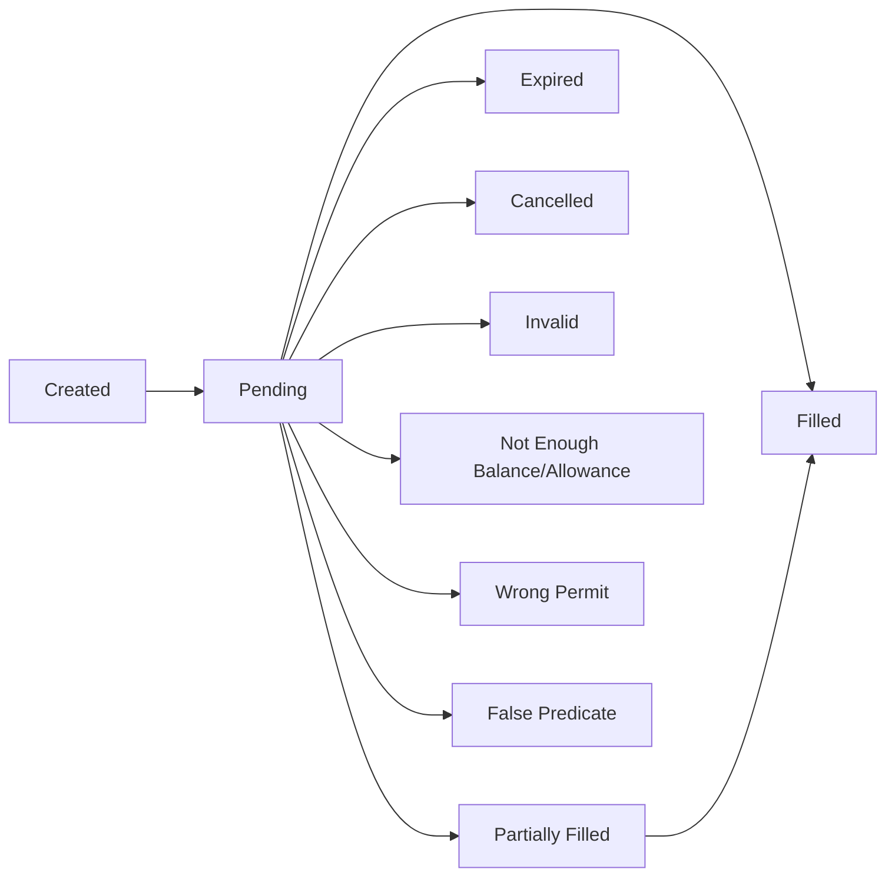

## Order states

A Fusion order progresses through several states during its lifetime. Understanding these states helps you monitor and manage your swaps effectively.



### OrderStatus enum

The SDK defines the following order states:

<ParamField path="Pending" type="string">
  Order is active and waiting for resolver execution. This is the normal state for orders in the auction.
</ParamField>

<ParamField path="Filled" type="string">
  Order has been completely executed by a resolver. You've received your tokens.
</ParamField>

<ParamField path="PartiallyFilled" type="string">
  Order has been partially executed (only possible if you enabled partial fills). May be filled completely later.
</ParamField>

<ParamField path="Expired" type="string">
  Order auction has ended without execution. The order is no longer valid.
</ParamField>

<ParamField path="Cancelled" type="string">
  Order was explicitly cancelled by you before execution.
</ParamField>

<ParamField path="InvalidSignature" type="string">
  The order signature is invalid. This usually indicates a configuration error.
</ParamField>

<ParamField path="NotEnoughBalanceOrAllowance" type="string">
  Your wallet doesn't have sufficient token balance or hasn't approved the contract.
</ParamField>

<ParamField path="WrongPermit" type="string">
  The permit signature provided is invalid or expired (if using EIP-2612 permits).
</ParamField>

<ParamField path="FalsePredicate" type="string">
  Custom predicate conditions are not met. Order cannot execute yet.
</ParamField>

## Order lifecycle stages

### 1. Order creation

The process begins when you create an order:

```typescript
import { FusionSDK, NetworkEnum } from '@1inch/fusion-sdk'

const sdk = new FusionSDK({
  url: 'https://api.1inch.dev/fusion',
  network: NetworkEnum.ETHEREUM,
  blockchainProvider: connector,
  authKey: 'your-api-key'
})

// Create the order
const params = {
  fromTokenAddress: '0x6b175474e89094c44da98b954eedeac495271d0f', // DAI
  toTokenAddress: '0xc02aaa39b223fe8d0a0e5c4f27ead9083c756cc2',  // WETH
  amount: '1000000000000000000000', // 1000 DAI
  walletAddress: '0xYourAddress'
}

const preparedOrder = await sdk.createOrder(params)
console.log('Order hash:', preparedOrder.hash)
console.log('Quote ID:', preparedOrder.quoteId)
```

At this stage:
- Order is constructed with auction parameters
- A unique order hash is generated
- Order is **not yet submitted** to the network

### 2. Order submission

Submit the order to make it visible to resolvers:

```typescript
// Sign and submit the order
const result = await sdk.submitOrder(
  preparedOrder.order,
  preparedOrder.quoteId
)

console.log('Order submitted:', result.orderHash)
console.log('Signature:', result.signature)
```

<Note>
For native token swaps (ETH, BNB, etc.), you must also submit an on-chain transaction. See the [Native token swaps guide](/guides/native-token-swaps).
</Note>

After submission:
- Order enters the **Pending** state
- The Dutch auction begins
- Resolvers can see and compete for your order

### 3. Auction period

During the auction (typically 60-180 seconds):

- Price starts high (favorable to resolvers)
- Price gradually decreases toward your minimum
- Resolvers monitor and calculate optimal execution timing
- First resolver to execute at current price wins

You can monitor the auction in real-time:

```typescript
// Check current status
const status = await sdk.getOrderStatus(result.orderHash)

console.log('Current status:', status.status)
console.log('Auction start:', new Date(status.auctionStartDate * 1000))
console.log('Auction duration:', status.auctionDuration, 'seconds')
```

### 4. Execution or expiration

The auction concludes in one of several ways:

<Tabs>
  <Tab title="Successful execution">
    A resolver executes your order:

    ```typescript
    const status = await sdk.getOrderStatus(orderHash)

    if (status.status === OrderStatus.Filled) {
      console.log('Order filled!')
      console.log('Transaction:', status.fills[0].txHash)
      console.log('Filled amount:', status.fills[0].filledMakerAmount)
    }
    ```

    The order moves to **Filled** state and settlement occurs on-chain.
  </Tab>

  <Tab title="Partial execution">
    If partial fills are enabled, the order may be partially filled:

    ```typescript
    if (status.status === OrderStatus.PartiallyFilled) {
      console.log('Partially filled')
      console.log('Fills so far:', status.fills.length)
      
      const totalFilled = status.fills.reduce(
        (sum, fill) => sum + BigInt(fill.filledMakerAmount),
        0n
      )
      console.log('Total filled:', totalFilled)
    }
    ```
  </Tab>

  <Tab title="Expiration">
    If no resolver executes before the deadline:

    ```typescript
    if (status.status === OrderStatus.Expired) {
      console.log('Order expired without execution')
      console.log('No tokens were swapped')
    }
    ```

    Your tokens remain in your wallet unchanged.
  </Tab>

  <Tab title="Cancellation">
    You can cancel the order before execution:

    ```typescript
    const cancelCallData = await sdk.buildCancelOrderCallData(orderHash)
    
    // Submit cancellation transaction
    // ... send transaction with cancelCallData
    
    // Later check status
    if (status.status === OrderStatus.Cancelled) {
      console.log('Order successfully cancelled')
    }
    ```
  </Tab>
</Tabs>

## Monitoring order progress

### Polling for status updates

Use polling to track order progress:

```typescript
import { OrderStatus } from '@1inch/fusion-sdk'

async function waitForOrderCompletion(orderHash: string) {
  const maxAttempts = 60 // 5 minutes with 5-second intervals
  let attempts = 0

  while (attempts < maxAttempts) {
    const status = await sdk.getOrderStatus(orderHash)

    // Check terminal states
    if (status.status === OrderStatus.Filled) {
      console.log('✅ Order filled successfully')
      console.log('Transaction:', status.fills[0].txHash)
      return status
    }

    if (status.status === OrderStatus.Expired) {
      console.log('❌ Order expired')
      return status
    }

    if (status.status === OrderStatus.Cancelled) {
      console.log('🚫 Order cancelled')
      return status
    }

    if (status.status === OrderStatus.NotEnoughBalanceOrAllowance) {
      console.log('⚠️ Insufficient balance or allowance')
      return status
    }

    console.log(`⏳ Order pending (attempt ${attempts + 1}/${maxAttempts})`)
    await new Promise(resolve => setTimeout(resolve, 5000))
    attempts++
  }

  console.log('⏱️ Monitoring timeout')
  return null
}

// Use it
const finalStatus = await waitForOrderCompletion(result.orderHash)
```

### Real-time updates with WebSocket

For real-time updates, use the WebSocket API:

```typescript
import { WebSocketApi, NetworkEnum } from '@1inch/fusion-sdk'

const ws = new WebSocketApi({
  url: 'wss://api.1inch.dev/fusion/ws',
  network: NetworkEnum.ETHEREUM,
  authKey: 'your-api-key'
})

// Listen for all order events
ws.order.onOrder((event) => {
  console.log('Order event:', event.event)
  console.log('Data:', event.data)
})

// Listen for specific events
ws.order.onOrderFilled((data) => {
  console.log('✅ Order filled!', data.orderHash)
})

ws.order.onOrderInvalid((data) => {
  console.log('❌ Order invalid:', data.orderHash)
})

ws.order.onOrderCancelled((data) => {
  console.log('🚫 Order cancelled:', data.orderHash)
})
```

See the [WebSocket integration guide](/guides/websocket-integration) for more details.

## Fill information

When an order is filled, you receive detailed execution information:

```typescript
const status = await sdk.getOrderStatus(orderHash)

if (status.fills.length > 0) {
  for (const fill of status.fills) {
    console.log('Transaction hash:', fill.txHash)
    console.log('Filled maker amount:', fill.filledMakerAmount)
    console.log('Filled taker amount:', fill.filledAuctionTakerAmount)
    
    if (fill.takerFeeAmount) {
      console.log('Taker fee:', fill.takerFeeAmount)
    }
  }
}
```

Each fill contains:

<ResponseField name="txHash" type="string">
  On-chain transaction hash where the fill occurred
</ResponseField>

<ResponseField name="filledMakerAmount" type="string">
  Amount of your source tokens that were swapped
</ResponseField>

<ResponseField name="filledAuctionTakerAmount" type="string">
  Amount of destination tokens you received
</ResponseField>

<ResponseField name="takerFeeAmount" type="string | null">
  Fee charged by the resolver (if any)
</ResponseField>

## Order validation

Before execution, your order must pass several validation checks:

### Balance and allowance

```typescript
// Ensure you have sufficient balance
const balance = await tokenContract.balanceOf(walletAddress)
console.log('Token balance:', balance)

// Ensure you've approved the Fusion contract
const allowance = await tokenContract.allowance(
  walletAddress,
  '0x111111125421ca6dc452d289314280a0f8842a65' // 1inch Limit Order V4 contract
)
console.log('Current allowance:', allowance)

// If needed, approve
if (allowance < swapAmount) {
  await tokenContract.approve(
    '0x111111125421ca6dc452d289314280a0f8842a65',
    swapAmount
  )
}
```

### Signature validation

The order signature must be valid:

```typescript
// The SDK handles signing automatically
const signature = await sdk.signOrder(order)

// For native orders, use nativeSignature
const nativeSig = sdk.signNativeOrder(order, makerAddress)
```

<Warning>
An invalid signature will cause your order to be rejected immediately with `InvalidSignature` status.
</Warning>

## Common state transitions

### Normal execution flow

```
Created → Pending → Filled
```

1. Create order locally
2. Submit to network (Pending)
3. Resolver executes (Filled)

### Order expires

```
Created → Pending → Expired
```

1. Create order locally
2. Submit to network (Pending)
3. No resolver executes before deadline (Expired)

### Manual cancellation

```
Created → Pending → Cancelled
```

1. Create order locally
2. Submit to network (Pending)
3. You cancel the order (Cancelled)

### Insufficient balance

```
Created → Pending → NotEnoughBalanceOrAllowance
```

1. Create order locally
2. Submit to network (Pending)
3. Balance or allowance becomes insufficient (NotEnoughBalanceOrAllowance)

## Best practices

<CardGroup cols={2}>
  <Card title="Check balance first" icon="wallet">
    Always verify you have sufficient balance and allowance before creating orders
  </Card>
  <Card title="Monitor actively" icon="eye">
    Use WebSocket for real-time updates on important orders
  </Card>
  <Card title="Handle all states" icon="list-check">
    Implement proper error handling for all possible order states
  </Card>
  <Card title="Set reasonable timeouts" icon="clock">
    Don't monitor orders indefinitely - set maximum wait times
  </Card>
</CardGroup>

## Next steps

<CardGroup cols={2}>
  <Card title="Placing orders" icon="paper-plane" href="/guides/placing-orders">
    Complete guide to creating and submitting orders
  </Card>
  <Card title="Order management" icon="list-check" href="/guides/order-management">
    Learn how to check status and cancel orders
  </Card>
  <Card title="WebSocket integration" icon="satellite-dish" href="/guides/websocket-integration">
    Real-time order monitoring
  </Card>
  <Card title="FusionSDK API" icon="code" href="/api/fusion-sdk">
    Complete API reference
  </Card>
</CardGroup>
